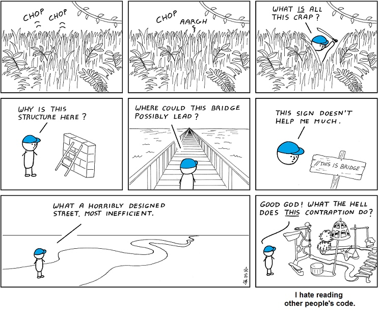

# 高效工程师的7个技能
## 原文地址
[7 Skills of Highly “Effective” Programmers](https://medium.com/better-programming/7-habits-of-highly-effective-programmers-563ee3b63f33)

软件工程师为了面试花费大量的时间通过练习[leet code的问题](https://medium.com/better-programming/the-software-engineering-study-guide-bac25b8b61eb)获取技能，并优化简历。

一旦他们最后获得了初创公司、谷歌、亚马逊或者其他公司的工作，他们也许会发现他们用来找工作那些技能和他们日常工作中需要的不匹配。

我们团队受TechLead创建的高效工程师的7个技能的启发，我们想针对这个主题提供我们自己的想法。

这是我们高效工程师的7个技能。

## 1. 学会如何阅读他人的代码

除你之外的每一个人的代码都是糟糕的。

这就是为什么一项具有很多好处的很棒的技能是能够读懂他人的代码。

不管一个以前工程师的代码是多么杂乱、无脑，你仍然需要能够读懂它，毕竟，这是你的工作。甚至当那个工程师就是一年以前的你。

这项技能对你的好处有两方面。一，能够阅读他人的代码是一个非常好的机会去学习糟糕的设计是什么样的。当你阅览他人代码时你能学习到哪些是有效的和哪些是无效的。最重要的是，你能够学到对于其他工程师什么类型的代码是容易理解的，什么代码是难以理解的。

你需要确保尽可能说的阅读别人的代码，这样，其他工程师就会了解到你是一个多么优秀的工程师了。

确保你提出的关于代码可维护性和良好的注释的重要性的要点。这进一步显示了你在编程领域的优越性。   

你的代码应该设计的很好，不需要写文档。事实上，如果你是一个好的程序员，你不应该写任何文档对于你的代码。这只是在浪费时间，你应该把你的时间花费到编码和开会上。

能够阅读别人的杂乱的代码也能在需要更新的时候容易一些。有时这意味着更新你缺乏经验的代码（应该是不熟悉的代码）。例如，我们曾经跟进一个脚本从Powershell到Python到Perl。我们缺乏Perl的经验，但是我们仍然有足够的上下文来弄清楚发生了什么并根据需要做一些改变。

这源于对所有代码有深入的理解以及能够读懂Perl脚本。

阅读别人的代码使你有价值，应为你甚至可以理解过度设计系统，这些系统可能另别人感到困惑。

## 识别不良项目
这有很多技能需要花费时间去学。我们认为其中一个技能是了解哪些项目不值得做，哪些项目显然是举步维艰的。

大公司总是正在进行的项目比可能完成或影响更大的项目多的多。有些项目可能没有任何商业意识（至少对你而言），还有其他项目缺乏管理。这并不说当你不同意该项目时应该阻止该项目，然而，如果利益相关者无法很好的解释他们将做的事情的最终结果，也许这个项目就不值得去做。

当然，有些项目可能过于关注技术而不是解决方案，因此从一开始就很明显不会产生太大影响。 在了解到底什么是坏项目之前，这项技能需要做很多坏项目。 因此，不要花太多时间在尝试辨别每个项目上。

在你职业生涯的某个阶段，你将拥有良好的直觉。

## 避免开会
不论你是软件工程师还是数据科学家，开会是必要的，因为你需要和项目经历、最终用户和客服达成共识。然而，会议占据你整个日程也成为一种趋势。这就是为什么学会如何避免那些不需要的会议是很重要的。也许使用管理比避免更好一些。这里的目标是确保你在会议上花费的时间用来制作决策和帮助推动项目前进。

## Github…Wait no Git?

## 写简单的可维护的代码

## 学会说不和优先排序

## 运营设计思维
